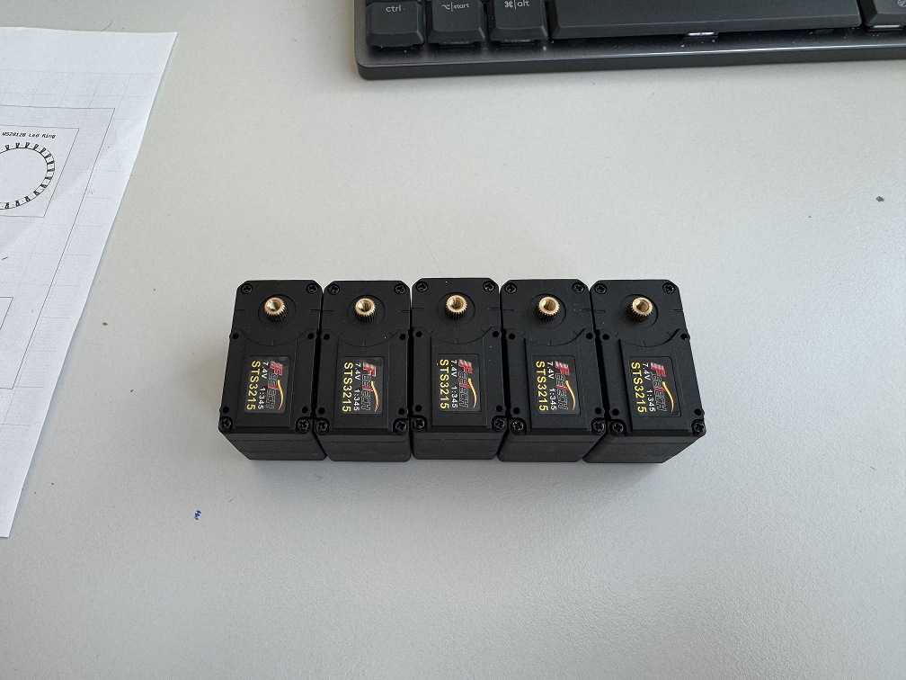
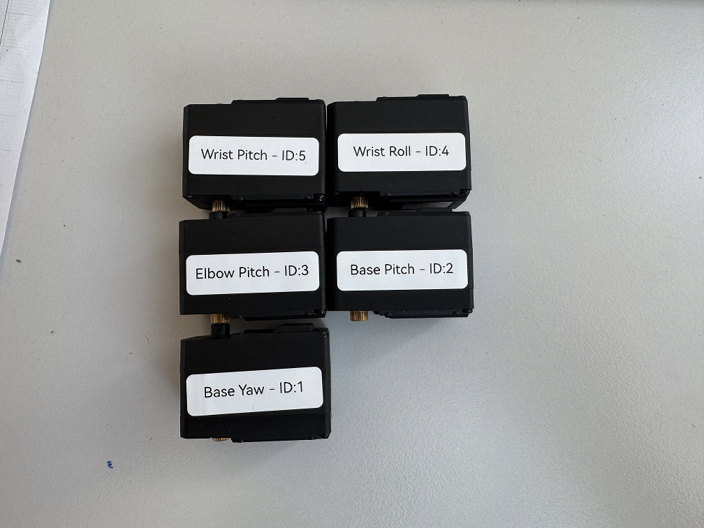

# Servo Setup

**⏱️ Estimated time:** 30-45 minutes  
**🔧 Required tools:** Computer, servo driver, USB cable  
**📦 Required components:** 5x STS3215 servos, servo driver board

The first part of building your LeLamp is setting up your servos.

## 1. Unbox and lay your servos on a table.



## 2. Label your servos.



| Servo Name  | Servo ID |
| ----------- | -------- |
| base_yaw    | 1        |
| base_pitch  | 2        |
| elbow_pitch | 3        |
| wrist_roll  | 4        |
| wrist_pitch | 5        |

Based on the table above, you should label your servo accordingly. There's no particular order to this or specific servo you should label with a certain ID.

The end result is having 5 servos, each with a label that tells you which is which.

## 3. Run LeLamp's motor setup script.


After labeling your servo, connect the servo driver to your computer and figure which port it is connected to.

Inside `lelamp_runtime`, you can find port this by running:

```bash
uv run lerobot-find-port
```

For motor setup, inside `lelamp_runtime`, run the following command and connect the servo accordingly:

```bash
uv run -m lelamp.setup_motors --id your_lamp_name --port port_your_servo_driver_is_connected_to
```

Example:

```bash
uv run -m lelamp.setup_motors --id lelamp --port /dev/tty.usbmodem5A680114681
```

Remember the name you set for your lamp, you will use it again in the future.

## Success Criteria

After completing servo setup, you should have:
- [ ] 5 servos labeled with their intended positions
- [ ] All servos responding correctly to commands
- [ ] Servo IDs properly configured (1-5)
- [ ] Motor setup script completed successfully

## Troubleshooting

**Common issues:**
- **Servo not detected**: Check USB connection and port
- **Permission errors**: May need `sudo` or add user to dialout group
- **Servo ID conflicts**: Ensure each servo has unique ID

---

**Previous**: [Schematics](./1.%20Schematics.md) | **Next**: [Lamp Head](./3.%20Lamp%20Head.md)
