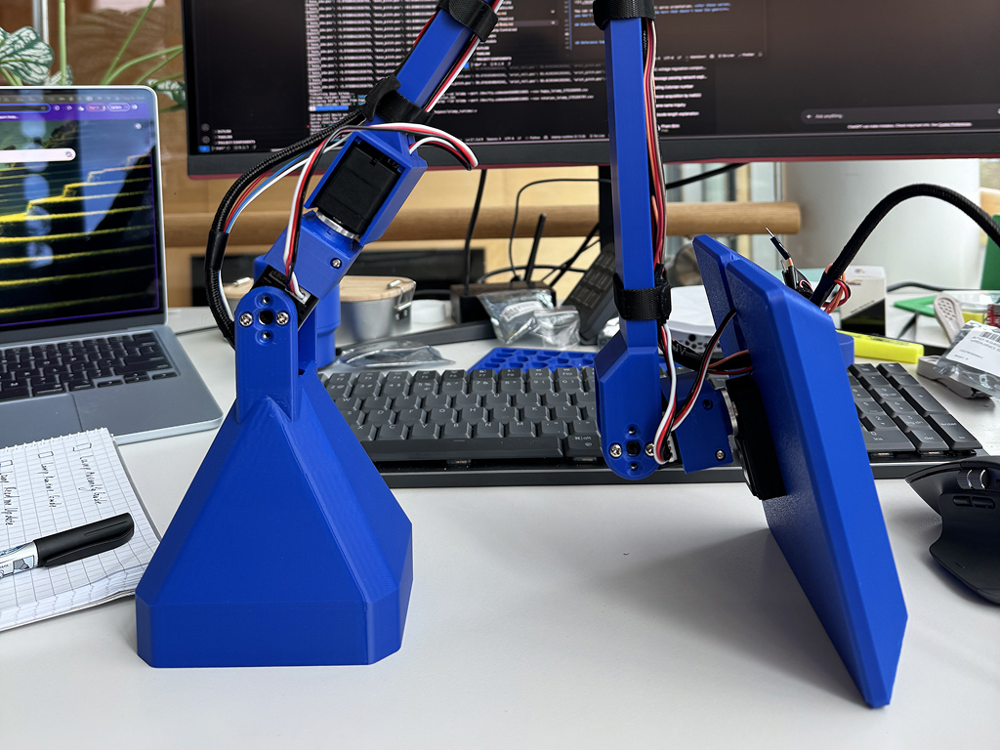

# Lamp Body Assembly

**⏱️ Estimated time:** 2-3 hours  
**🔧 Required tools:** Heat insert tool, Allen keys (M2/M3), screwdrivers, wire management tools  
**📦 Required components:** 3D printed parts, 5 servos, heat inserts, screws, buck converter

After assembling your lamp head, the body is next.

## Prerequisites

This assumes you have already:
- ✅ Printed all 3D parts and removed supports
- ✅ Completed servo setup with proper IDs
- ✅ Assembled and tested lamp head
- ✅ Prepared all electrical components

If you haven't done this, reference the [Schematics documentation](./1.%20Schematics.md).

## Assembling

There is no particular order to assemble LeLamp's body. You can start from any part of the body.

To help this process, we divided LeLamp's body into 2 parts:

- **Upper Body**: From elbow to wrist
- **Lower Body**: From base to elbow

### Upper Body

You can reference this image for servo placement. For servo orientation, please refer to the section below.

### Lower Body

You can reference this image for servo placement. For servo orientation, please refer to the section below.

### Servo Orientation

You can reference this image for pitch servo orientation. If you look at LeLamp from a top down view, with wire slit on the base facing right, the pitch servo horns should face outward from you or should face ahead.

You can reference this image for yaw and roll servo orientation. **For these servos, you don't need to attach the support horn (the horn that doesn't have the gears)**.

## Electronics

If you assemble you lamp head according to the guide and the schematic, there should be these coming out of the head:

- A speaker
- A pair of 5V and ground wire for the pi
- A type c wire

You should route these wires along the body of the lamp. It is recommended to use wire organizers here, either tie, wire spirals or wire sleeves.

It should look like this from the side:

On the bottom of the base, here is a reference image:

To screw in the speaker and servo driver, you can use heat inserts, but it is not required to do so. Screws should be able to tap their own threads into the prints.

Route your wires according to the schematic.

## Assembly Completion Checklist

After completing lamp body assembly, verify:
- [ ] All servos properly mounted in 3D printed parts
- [ ] Servo horns correctly oriented (pitch outward, yaw/roll without support horn)
- [ ] All heat inserts installed securely
- [ ] Servo driver and speaker mounted in base
- [ ] Power wiring completed (5V from buck converter)
- [ ] All cables properly routed and organized
- [ ] No mechanical interference between moving parts
- [ ] Joints move smoothly through full range of motion

## What You Should Have

At this stage, you should have:
- **Complete mechanical assembly** with all 5 servos installed
- **Functional power system** with buck converter providing stable 5V
- **Proper cable management** using wire organizers or sleeves
- **Tested movement** - all joints should move without binding

## Safety Notes

⚠️ **Before powering on the complete system:**
- Double-check all power connections for correct polarity
- Ensure no short circuits between power and ground
- Verify servo cables are properly connected
- Test individual components before full integration

---

**Previous**: [Lamp Head](./3.%20Lamp%20Head.md) | **Next**: [Lamp Control](./5.%20Lamp%20Control.md)
